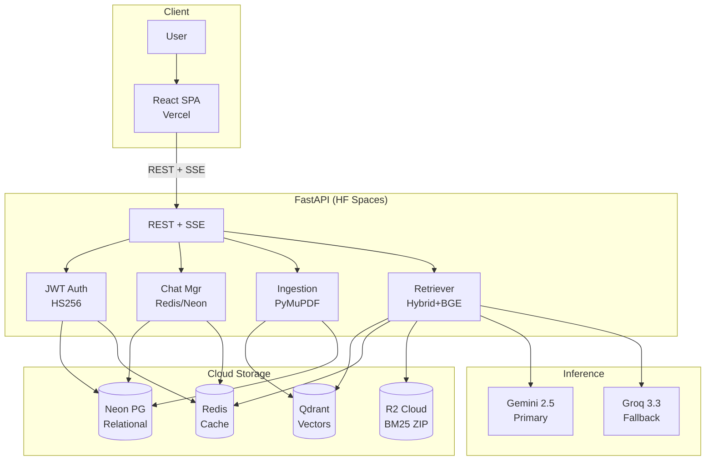
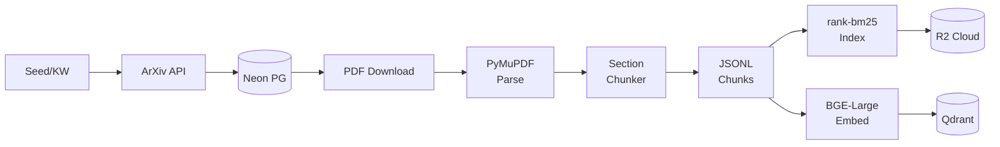
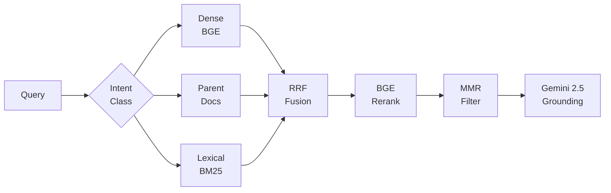
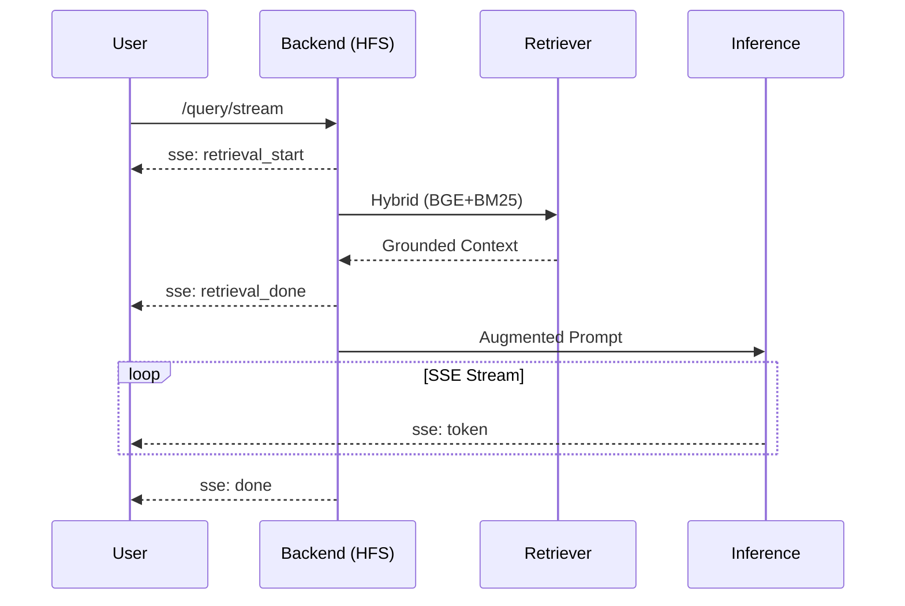
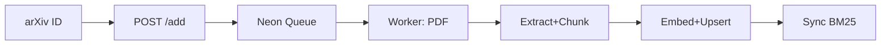
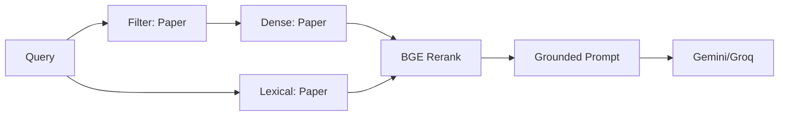
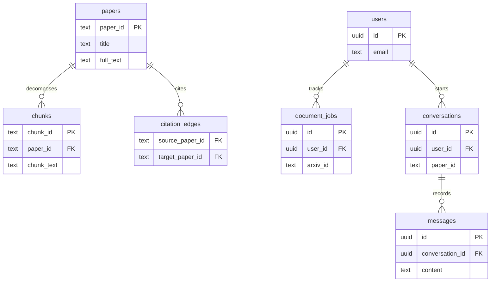

# ArXiv RAG Assistant — Technical Architecture

This document contains the deep technical specifications, pipeline details, database schemas, and CLI references for the ArXiv RAG Assistant. For a high-level overview, see the [main README](README.md).

---

## 1. System Architecture

---

## 2. Offline Ingestion Pipeline

### Chunking Strategy: Hierarchical Section-Sentence
1. **Section Detection** — Regex-based heading detection splits papers into sections (Introduction, Methods, Results, etc.)
2. **Sentence Packing** — NLTK sentence tokenizer packs sentences into chunks within each section.
3. **Profile-Based Sizing** — Target chunk sizes: `small` (250 tokens), `medium` (350 tokens), `large` (500 tokens).
4. **Overlap** — Last 1-2 sentences from previous chunk carried forward (≤80 tokens).
5. **Quality Validation** — Short chunks warned; runaway chunks rejected. Strips References/Appendices.
6. **Contextual Text** — Chunks enriched with title, authors, categories, section label, and local summary prefix.

### Parent–Child (`arxiv_docs`)
`arxiv_docs` stores **one vector per paper** built from **title + abstract**. Parent search targets the paper’s core contribution, then expands to pull the best in-paper chunks from `arxiv_text`.

---

## 3. Retrieval Pipeline

### Retrieval Features & Ablations

| Feature / Variable | Description |
|--------------------|-------------|
| **Dense Retrieval** | Qdrant `arxiv_text` with BGE-large-en-v1.5 (1024-dim). Disable with `RETRIEVAL_SKIP_DENSE=true`. |
| **Lexical Retrieval**| BM25 on tagged fields. Disable with `RETRIEVAL_SKIP_LEXICAL=true`. |
| **RRF Fusion** | Intent-aware merge weights. Disable rerank with `RETRIEVAL_SKIP_RERANK=true`. |
| **Parent-Child** | Expands chunks from `arxiv_docs` hits. `ENABLE_PARENT_CHILD` |
| **MMR Diversity** | Cosine-similarity deduplication. `ENABLE_MMR` |
| **Section Boosting**| Intent-specific weight multipliers (e.g. Methods×1.32 for technical). |
| **Expansion Gating**| Intent-aware bypass of LLM/embedding expansions for precision lookups. |
| **HyDE / Expansion**| LLM query expansion (Discovery only). `ENABLE_HYDE=false` (default off). |
| **Context Sizing**  | Intent-aware chunk limits (4–6 chunks) to reduce noise. |
| **Verification**    | Post-generation grounding verification heuristic. |

---

## 4. Core Workflows

### General Chat Flow (Streaming)

### Add Document Flow

### Chat with Document

---

## 5. Database Schema

### Neon PostgreSQL

### Qdrant Cloud Collections
- `arxiv_text`: Chunk-level vectors (1024-dim BGE). Payload includes chunk_text, contextual_text, section_hint.
- `arxiv_docs`: Paper-level centroid vectors (1024-dim). Payload includes paper_id, title, abstract.

---

## 5. API Endpoints

| Method | Path | Auth | Description |
|--------|------|------|-------------|
| `GET` | `/health` | No | Health check with collection + cache stats |
| `POST` | `/query` | No | Corpus-wide retrieval + Groq generation |
| `POST` | `/query/stream` | No | SSE streaming variant of `/query` |
| `GET` | `/paper/{id}` | No | Paper metadata lookup |
| `GET` | `/paper/{id}/similar` | No | Mean-embedding similar paper search |
| `POST` | `/auth/login` | No | Login + return JWTs |
| `POST` | `/auth/refresh` | No | Refresh access token |
| `POST` | `/conversations/{id}/query/stream` | Yes | Authenticated SSE streaming chat |
| `POST` | `/documents/add` | Yes | Queue live arXiv document ingestion |
| `GET` | `/metrics/performance` | No | Rolling latency + cache metrics |

---

## 6. Environment Variables

| Variable | Purpose |
|----------|---------|
| `DATABASE_URL` | Neon PostgreSQL connection string |
| `QDRANT_URL` / `API_KEY`| Qdrant Cloud cluster |
| `REDIS_URL` | Redis Cloud for session/query cache |
| `GOOGLE_API_KEY` | Gemini 2.5 Flash (authenticated chats) |
| `GROQ_API_KEY` | Groq fallback + public queries |
| `R2_ACCESS_KEY_ID` | Cloudflare R2 credentials |
| `JWT_SECRET_KEY` | JWT signing secret |

---

## 7. CLI Commands Reference

All commands run from `backend/` using `conda run -n pytorch` (or equivalent).

| Command | Purpose |
|---------|---------|
| `python -m cli ingest --mode all` | Run seed, keyword, and citation ingestion |
| `python -m cli chunk --reset` | Hierarchical section-sentence chunking |
| `python -m cli index --target both` | Build Qdrant vectors + BM25 artifacts |
| `python -m cli reset --yes` | Delete derived artifacts + reset Qdrant |
| `python -m cli health` | Corpus health summary from Neon |
| `python -m cli sync-metadata` | Sync paper metadata from artifacts → Neon |
| `python scripts/upload_artifacts.py` | Zip + upload BM25 bundle to R2 |

---

## 8. Evaluation & Observability

- **Retrieval Metrics**: Recall@K, Precision@K, MRR, nDCG@K evaluated via `backend/rerank/evaluate.py`.
- **RAGAS**: Faithfulness, Response Relevancy, Context Precision evaluated via `backend/eval/ragas_eval.py`.
- **Query Traces**: Detailed latency and stage timing written to `logs/queries.jsonl`.
- **Performance**: Exposes rolling P50/P95/P99 latency via `/metrics/performance`.
