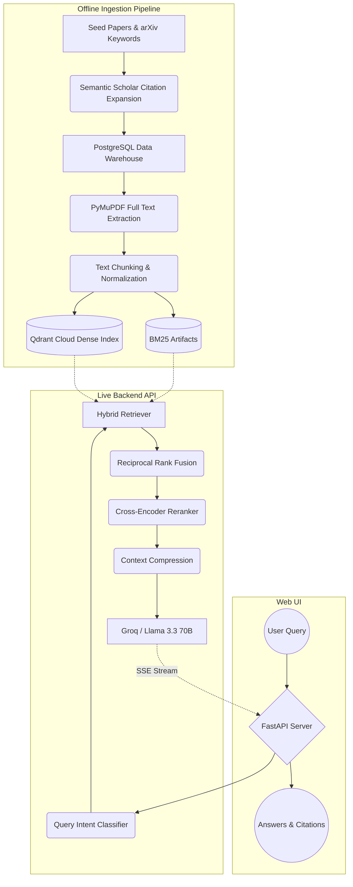

# End-to-End System Architecture

The ArXiv RAG Assistant is a specialized, production-grade Retrieval-Augmented Generation (RAG) system built to query mechanistic interpretability research. It relies on a multi-stage architecture split broadly into an **Offline Ingestion & Indexing Pipeline** and a **Live Hybrid RAG Backend**.

---

## 1. High-Level System Flow

---

## 2. Data Ingestion & Indexing Pipeline (Offline)

The system begins offline by building a curated, structured corpus. **PostgreSQL** is utilized here strictly as the offline data warehouse to store raw content, manage extraction state, and maintain the citation graph. It is **not** queried directly during live inference.

### 2.1. Corpus Building
- **Seed Driven**: The process starts with a curated list of seed papers.
- **Citation Expansion**: The Semantic Scholar API fetches both backward (prerequisite) and forward (subsequent) citations.
- **Keyword Gap Filling**: Broad queries against the arXiv API capture any missed mechanistic interpretability papers.

### 2.2. Processing & Storage
- **PostgreSQL (`db/schema.sql`)**: Acts as the central hub. It tracks paper metadata, download/parsing statuses, layer tags (e.g., `prerequisite`, `foundation`, `core`, `latest`), and citation edges.
- **PDF Parsing**: PyMuPDF downloads and extracts full text, filtering out references, acknowledgments, and appendices.
- **Chunking**: Text is split into 450-token windows with 15% overlap. Sections are detected (e.g., Method, Results) and tagged as metadata.

### 2.3. Index & Artifact Generation
- **Dense Vectors**: Chunks are embedded using `BAAI/bge-large-en-v1.5` and pushed to **Qdrant Cloud**.
- **Lexical/Metadata Artifacts**: `rank_bm25` indexes and JSON metadata files are generated and packaged as `.pkl`/`.jsonl` artifacts for fast in-memory loading in production.

---

## 3. Live API & AI Engine

The live API is built with **FastAPI** and is optimized for low-latency, stateless deployment (e.g., Hugging Face Spaces or Render). It serves real-time answers using a hybrid retrieval and reranking loop.

### 3.1. Query Intent Classification
When a query is received, an intent classifier (`api/retrieval.py`) uses regex-based patterns to categorize it into one of five intents:
- `explanatory`, `comparative`, `technical`, `sota`, or `discovery`.
This intent drives retrieval weights, prompt templates, and generation temperature.

### 3.2. Hybrid Retrieval
- **Dense Retrieval**: Qdrant Cloud performs an Approximate Nearest Neighbor (ANN) search using `BGE-large-en-v1.5` embeddings.
- **Lexical Retrieval**: An in-memory `rank_bm25` index (loaded via joblib on startup) performs fast keyword matching over chunk texts.

### 3.3. Fusion & Reranking
- **Reciprocal Rank Fusion (RRF)**: Dense and lexical candidates are merged using intent-aware weighting (e.g., `explanatory` favors dense; `discovery` favors lexical).
- **Paper-Level Diversity**: Results are deduplicated to ensure a single paper doesn't dominate the results.
- **Cross-Encoder**: Candidates are reranked using `cross-encoder/ms-marco-MiniLM-L-6-v2`. This cross-encoder evaluates the exact semantic relationship between the query and the chunk text.

### 3.4. Answer Generation (LLM)
- **Context Compression**: Retrieved chunks are concatenated. Explanatory intents maintain source titles, while other intents aggressively compress context to save tokens.
- **Groq API**: The context and intent-specific system prompt are sent to `llama-3.3-70b-versatile` via the Groq API, utilizing low temperatures for precise, cited answers.

---

## 4. Frontend UI

The presentation layer is a single-page web application housed in `frontend/index.html`.

- **Vanilla HTML/CSS/JS**: Eliminates complex build steps while maintaining a responsive, academic aesthetic.
- **Server-Sent Events (SSE)**: Connects to the `/query/stream` endpoint to stream LLM generation token-by-token.
- **Interactive Citations**: Renders exact quotes, layer distributions, latency metrics, and paper reference links dynamically as the answer streams in.
