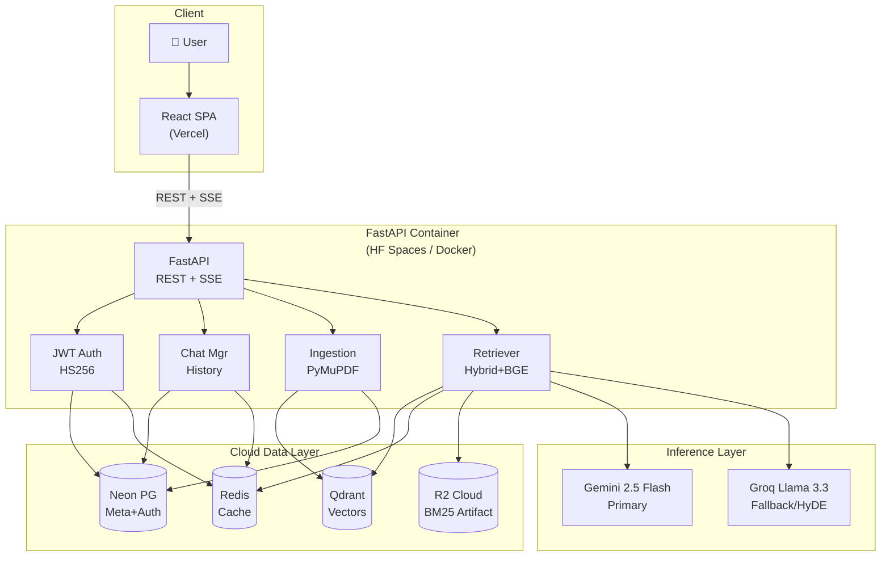
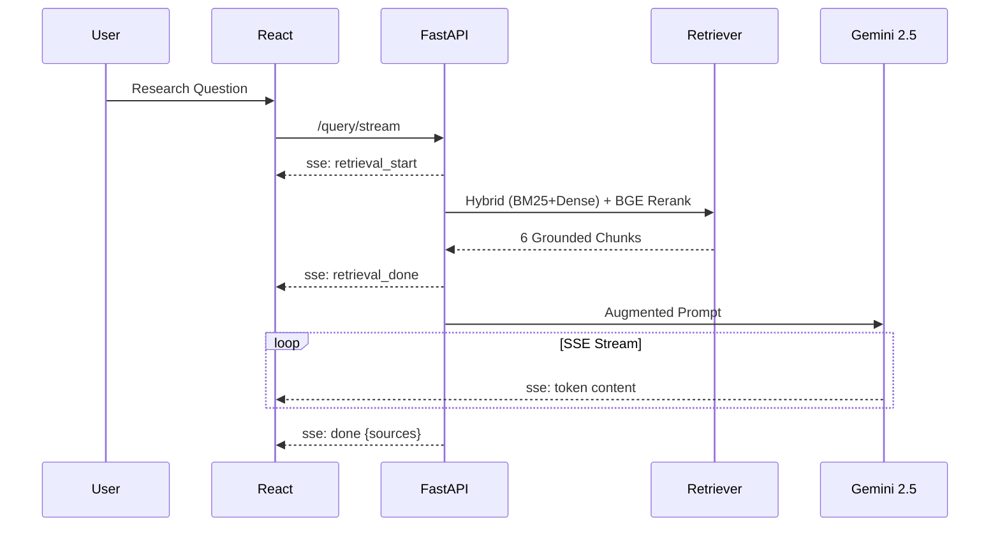
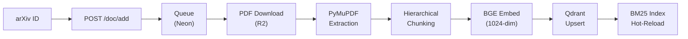
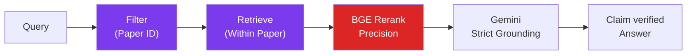
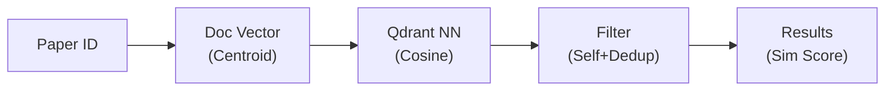

# ArXiv RAG Assistant — Mechanistic Interpretability

A production-grade **Retrieval-Augmented Generation (RAG)** research assistant designed for Mechanistic Interpretability papers. The system performs hybrid dense + lexical retrieval, multi-stage reranking, intent-aware fusion, and grounded LLM answer generation across a curated corpus of ~3,000 arXiv papers.

For database schemas, CLI commands, and API docs, see the [**Technical Architecture Guide**](ARCHITECTURE.md).

---

## Key Features

- **Hybrid Retrieval**: Combines dense vector search (Qdrant + BGE-Large) with lexical search (BM25) for high recall.
- **Scientific Rigor**: Intent-aware precision tuning with a dedicated `evidence` intent, rigorous attribution enforcement, and a post-generation grounding verification heuristic.
- **Advanced Pipeline**: BGE-Reranker-v2-m3, Parent-Child chunking, and MMR diversity filtering. Query expansion and HyDE restricted to discovery queries for maximum precision.
- **Fast SSE Streaming**: Token-by-token streaming responses with an optimistic UI and intent-aware context sizing (4–6 chunks).
- **Live Ingestion**: Add new arXiv IDs on the fly. Background workers fetch the PDF, chunk it, and update vector/lexical indexes in real time.
- **Document-Scoped Chat**: Chat exclusively with a single paper using strict database-level filtering.

---

## 1. System Architecture



---

## 2. Core Workflows

### General Chat Flow (Streaming)



### Add Document Flow (Live Ingestion)



### Chat with Document Flow



### Similar Papers Flow



---

## 3. Technology Stack

| Layer | Technology |
|-------|------------|
| **Frontend** | React 18 + Vite + Tailwind CSS (Vercel) |
| **Backend** | FastAPI 0.100+ (Python 3.10+) |
| **Vector DB** | Qdrant Cloud (HNSW, cosine, m=32, ef=400) |
| **Relational DB** | Neon PostgreSQL (papers, users, chats, jobs) |
| **Object Storage** | Cloudflare R2 (BM25 artifact bundle) |
| **Cache** | Redis Cloud (session cache, query cache) |
| **Embeddings** | BAAI/bge-large-en-v1.5 (1024-dim) |
| **Reranker** | BAAI/bge-reranker-v2-m3 |
| **Primary LLM** | Google Gemini 2.5 Flash |
| **Fallback LLM** | Groq LLaMA 3.3 70B Versatile |

---

## 4. Setup & Deployment

### Backend

Copy `.env.example` to `.env` and fill in API keys (Neon, Qdrant, Google, Groq).

```bash
cd backend
pip install -r requirements.txt
uvicorn api.app:app --host 0.0.0.0 --port 8000 --reload
```

### Frontend

Configure `VITE_API_URL` to point to the FastAPI backend.

```bash
cd frontend
npm install
npm run dev
```

### Deployment Strategy
- **Backend**: Deployed as a Docker container (Render, Hugging Face Spaces).
- **Frontend**: Deployed as a serverless SPA on Vercel.
- **Cold Starts**: On container boot, the backend fetches `artifacts_v1.zip` from Cloudflare R2 to load the BM25 lexical index instantly into memory, while vectors are served via Qdrant Cloud.

---

For deeper technical documentation, please see [**ARCHITECTURE.md**](ARCHITECTURE.md).
