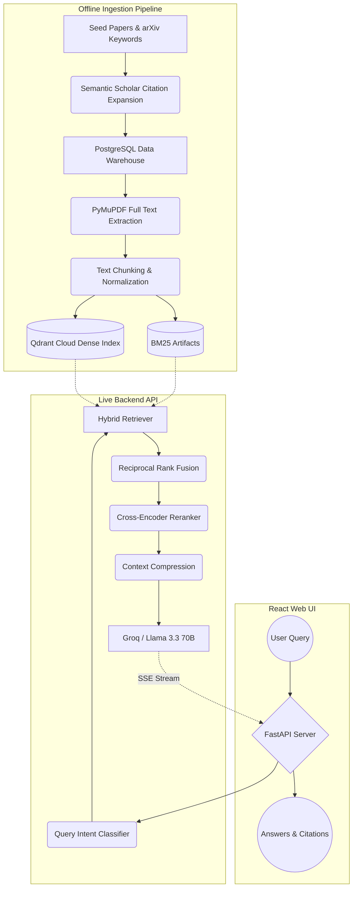

# ArXiv RAG Assistant — Mechanistic Interpretability

A production-grade **Retrieval-Augmented Generation (RAG)** system specialized for **mechanistic interpretability** research. Built around a curated corpus of transformer circuits, sparse autoencoders, activation patching, and related papers spanning 2017–2025.

## Architecture

The ArXiv RAG Assistant is a specialized, production-grade Retrieval-Augmented Generation (RAG) system built to query mechanistic interpretability research. It relies on a multi-stage architecture split broadly into an **Offline Ingestion & Indexing Pipeline** and a **Live Hybrid RAG Backend**.

### 1. High-Level System Flow



### 2. Data Ingestion & Indexing Pipeline (Offline)

The system begins offline by building a curated, structured corpus. **PostgreSQL** is utilized here strictly as the offline data warehouse to store raw content, manage extraction state, and maintain the citation graph. It is **not** queried directly during live inference.

#### 2.1. Corpus Building
- **Seed Driven**: The process starts with a curated list of seed papers.
- **Citation Expansion**: The Semantic Scholar API fetches both backward (prerequisite) and forward (subsequent) citations.
- **Keyword Gap Filling**: Broad queries against the arXiv API capture any missed mechanistic interpretability papers.

#### 2.2. Processing & Storage
- **PostgreSQL (`db/schema.sql`)**: Acts as the central hub. It tracks paper metadata, download/parsing statuses, layer tags (e.g., `prerequisite`, `foundation`, `core`, `latest`), and citation edges.
- **PDF Parsing**: PyMuPDF downloads and extracts full text, filtering out references, acknowledgments, and appendices.
- **Chunking**: Text is split into 450-token windows with 15% overlap. Sections are detected (e.g., Method, Results) and tagged as metadata.

#### 2.3. Index & Artifact Generation
- **Dense Vectors**: Chunks are embedded using `BAAI/bge-large-en-v1.5` and pushed to **Qdrant Cloud**.
- **Lexical/Metadata Artifacts**: `rank_bm25` indexes and JSON metadata files are generated and packaged as `.pkl`/`.jsonl` artifacts for fast in-memory loading in production.

### 3. Live API & AI Engine

The live API is built with **FastAPI** and is optimized for low-latency, stateless deployment (e.g., Hugging Face Spaces or Render). It serves real-time answers using a hybrid retrieval and reranking loop.

#### 3.1. Query Intent Classification
When a query is received, an intent classifier (`api/retrieval.py`) uses regex-based patterns to categorize it into one of five intents:
- `explanatory`, `comparative`, `technical`, `sota`, or `discovery`.
This intent drives retrieval weights, prompt templates, and generation temperature.

#### 3.2. Hybrid Retrieval
- **Dense Retrieval**: Qdrant Cloud performs an Approximate Nearest Neighbor (ANN) search using `BGE-large-en-v1.5` embeddings.
- **Lexical Retrieval**: An in-memory `rank_bm25` index (loaded via joblib on startup) performs fast keyword matching over chunk texts.

#### 3.3. Fusion & Reranking
- **Reciprocal Rank Fusion (RRF)**: Dense and lexical candidates are merged using intent-aware weighting (e.g., `explanatory` favors dense; `discovery` favors lexical).
- **Paper-Level Diversity**: Results are deduplicated to ensure a single paper doesn't dominate the results.
- **Cross-Encoder**: Candidates are reranked using `cross-encoder/ms-marco-MiniLM-L-6-v2`. This cross-encoder evaluates the exact semantic relationship between the query and the chunk text.

#### 3.4. Answer Generation (LLM)
- **Context Compression**: Retrieved chunks are concatenated. Explanatory intents maintain source titles, while other intents aggressively compress context to save tokens.
- **Groq API**: The context and intent-specific system prompt are sent to `llama-3.3-70b-versatile` via the Groq API, utilizing low temperatures for precise, cited answers.

### 4. Frontend UI

The presentation layer is a React-based single-page web application housed in `frontend-react/`.

- **React / TailwindCSS**: Eliminates complex build steps while maintaining a responsive, academic aesthetic with a dynamic light/dark mode.
- **Server-Sent Events (SSE)**: Connects to the `/query/stream` endpoint to stream LLM generation token-by-token.
- **Interactive Citations**: Renders exact quotes, layer distributions, latency metrics, and paper reference links dynamically as the answer streams in.

## Key Features

### Seed-Driven Corpus Building
- **15 curated seed papers** spanning 2017–2024 (Attention Is All You Need → Scaling Monosemanticity)
- **Backward citation expansion** — pull in foundational/prerequisite papers via references
- **Forward citation expansion** — capture newer work that builds on seeds
- **Keyword gap-filling** — targeted arXiv queries for mech interp topics
- **Timeline balancing** — enforce coverage across early (20–35%), middle (30–45%), and recent (20–35%) eras
- **Layer tagging** — every paper tagged as `prerequisite`, `foundation`, `core`, or `latest`

### Hybrid Retrieval Pipeline
- **Dense retrieval**: Qdrant Cloud with BGE-large-en-v1.5 embeddings (1024-dim, HNSW m=32)
- **Lexical retrieval**: In-memory `rank_bm25` index (BM25Okapi) loaded from local artifacts
- **RRF fusion**: Intent-aware Reciprocal Rank Fusion with per-intent weight tuning
- **Cross-encoder reranking**: cross-encoder/ms-marco-MiniLM-L-6-v2 on CPU (with automatic fallback to RRF scores)
- **Memory Optimized**: Chunk texts are decoupled from metadata for low-RAM deployments

### Intent-Aware Query Processing
- **5 query intents**: explanatory, comparative, technical, sota, discovery
- **Intent-specific prompts** — different LLM templates per intent
- **Intent-specific retrieval weights** — explanatory favors dense, discovery favors FTS
- **Context compression** — full-passage for explanatory, concatenated for others

### Full-Text Extraction
- **PDF download and parsing** with PyMuPDF (pdfplumber fallback)
- **Full-text normalization** — removes references, acknowledgements, appendix sections
- **Overlapping token chunking** — 450-token windows with 15% overlap
- **Section hint detection** — tags chunks with introduction, method, results, etc.

## Project Structure

```
db/
  schema.sql              PostgreSQL schema (papers, chunks, citation_edges)
  database.py             Connection manager + CRUD
ingest/
  ingest_arxiv.py         Seed + keyword ingestion with relevance filter
  citation_expander.py    Semantic Scholar citation expansion
  timeline_balancer.py    Era distribution checker + gap filler
  chunking.py             Full-text chunking with section detection
storage/
  local_pdf_store.py      Local PDF cache management
index/
  build_qdrant.py         Qdrant Cloud vector index builder
  build_bm25.py           BM25 artifact builder (joblib, jsonl)
  params.yaml             Pipeline configuration
api/
  app.py                  FastAPI server with streaming + non-streaming endpoints
  retrieval.py            Hybrid retrieval (dense + BM25 + RRF + reranking)
  fetch_data.py           Cloudflare R2 artifact bootstrapper
  entrypoint.sh           Docker entrypoint script
rerank/
  reranker.py             Cross-encoder reranking (ms-marco-MiniLM-L-6-v2)
  evaluate.py             Retrieval evaluation metrics (Recall, MRR, latency, RAM)
frontend/
  index.html              Web UI (single-page, academic theme)
data/                     (Generated) Artifacts and metadata mapping
scripts/
  upload_artifacts.py     Cloudflare R2 artifact uploader
  run_mech_interp_pipeline.bat
tests/
  test_eval.py            Unit + integration tests
```

## Setup

### Prerequisites
- Python 3.10+
- Qdrant Cloud cluster
- Groq API key (for LLM generation)
- Cloudflare R2 bucket (for artifact storage)

### 1. Environment Variables

Copy `.env.example` to `.env` and configure:

```env
# Vector Database
QDRANT_URL=https://your-cluster.qdrant.io
QDRANT_API_KEY=your_qdrant_api_key

# LLM
GROQ_API_KEY=gsk_...

# Cloudflare R2 (optional, for artifact storage)
R2_ACCOUNT_ID=...
R2_ACCESS_KEY_ID=...
R2_SECRET_ACCESS_KEY=...
R2_BUCKET_NAME=arxiv-rag-assist
R2_ENDPOINT=https://....r2.cloudflarestorage.com

# Models
EMBEDDING_MODEL=BAAI/bge-large-en-v1.5
RERANKER_MODEL=cross-encoder/ms-marco-MiniLM-L-6-v2
```

### 2. Install Dependencies

```bash
pip install -r requirements.txt
```

### 3. Run Full Pipeline

```bash
scripts\run_mech_interp_pipeline.bat
```

Or run steps individually:

```bash
# Step 1: Ingest seed papers
python ingest/ingest_arxiv.py --mode seed

# Step 2: Expand citations (Semantic Scholar)
python ingest/citation_expander.py

# Step 3: Keyword gap-fill (arXiv API)
python ingest/ingest_arxiv.py --mode keyword

# Step 4: Timeline balance check + fill
python ingest/timeline_balancer.py --fill-gaps

# Step 5: Download PDFs + extract full text
python ingest/ingest_arxiv.py --mode enrich --pdf-timeout 60

# Step 6: Chunk full text
python ingest/chunking.py --source auto --reset

# Step 7: Build vector and BM25 indexes
python index/build_qdrant.py
python index/build_bm25.py
```

### 4. Start API

```bash
uvicorn api.app:app --host 0.0.0.0 --port 8000 --reload
```

### 5. Docker Deployment

```bash
docker compose up -d
```

## API Endpoints

| Method | Path | Description |
|--------|------|-------------|
| `POST` | `/query` | Hybrid retrieval + rerank + LLM answer generation |
| `POST` | `/query/stream` | SSE streaming version of `/query` |
| `GET` | `/paper/{id}` | Paper metadata (includes `layer`, `is_seed`) |
| `GET` | `/paper/{id}/similar` | Find similar papers via embedding similarity |
| `GET` | `/health` | Health check with collection counts + cache stats |
| `GET` | `/keep-alive` | Lightweight ping for uptime monitoring |

## Hugging Face Spaces Deployment

The API is fully optimized for **stateless deployment** on Hugging Face Spaces (or Render) free CPU tiers:
- Uses `rank_bm25` loaded in-memory instead of PostgreSQL FTS.
- Idempotent `.sha256` checksum artifact download via `fetch_data.py` on cold starts.
- Model pre-warming during asynchronous background initialization so the `/health` probe passes instantly.


## Layer Tags

| Layer | Description |
|-------|-------------|
| `prerequisite` | Pre-2020 foundational work (transformers, attention, representation learning) |
| `foundation` | 2020–2022 work introducing key mech interp concepts |
| `core` | 2021–2024 direct mechanistic interpretability research |
| `latest` | 2024+ cutting-edge work |

## Configuration

See `index/params.yaml` for all configurable parameters including chunk sizes, embedding models, collection names, retrieval params, and timeline balance targets.
